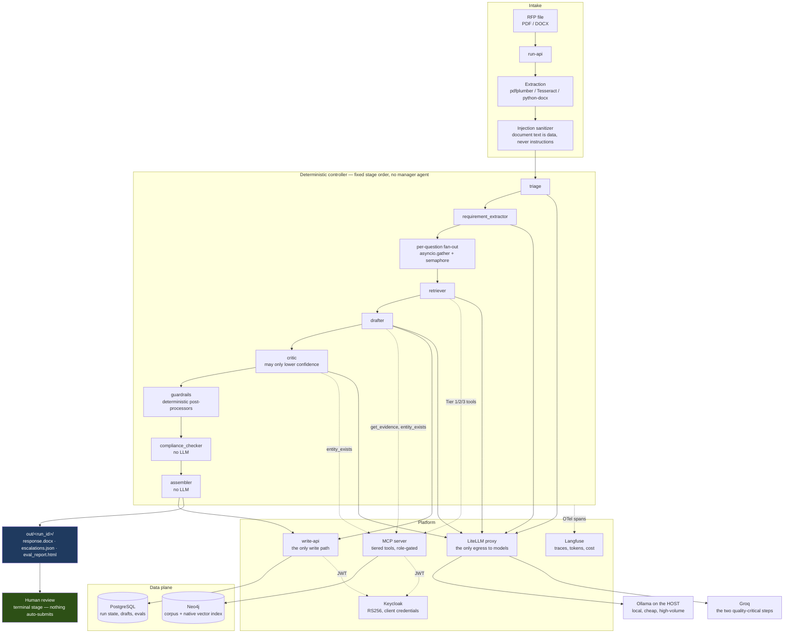

# rfp-workflow

An agentic workflow that ingests one cloud-migration RFP (PDF or DOCX) and
produces a filled draft response where **every answer carries a citation and a
computed confidence score**, an SME escalation list for what it could not
answer, and an automated evaluation report.

Human review is the terminal stage. Nothing is ever auto-submitted.

> **All data in this repository is synthetic.** Every vendor, customer, product,
> case study, and SME is fictional. No real RFP content exists here and none
> ever will (CLAUDE.md rule 1).

**Current phase: 1 of 6 — skeleton and contracts.** The compose stack, typed
contracts, migrations, identity, and CI gates are in place. There are no agents
and no model calls yet; that is deliberate, and the build order is described in
[Build phases](#build-phases) below.

---

## The idea

Most of an RFP response is not a writing problem. It is a retrieval and
governance problem: find what the firm has credibly said before, check that it
is still true, refuse to say anything that is not backed by a source, and route
the rest to a human who owns that topic.

So the model here does very little. It drafts prose, summarizes, and reranks.
Everything else — parsing, scoring arithmetic, template filling, entity lookups,
compliance checks, database writes — is deterministic code. That split is the
whole design, and it is enforced rather than encouraged: agents cannot write
Cypher or SQL, cannot import a provider SDK, cannot raise their own confidence,
and cannot loop.

## Architecture



## Why a knowledge graph

The graph is not a vector store with extra steps. It does six jobs, and dropping
any one of them would push work back onto a human or onto a model that should
not be doing it:

| Role | What it buys |
|---|---|
| **Corpus of record** | Q&A pairs with supersession chains. Superseded answers are flagged, never deleted, so the history of what changed stays auditable. |
| **Hybrid retrieval** | Vector similarity *and* constraint filters resolve in one query. No second datastore, so no sync-lag class of bug. |
| **Grounding registry** | A closed world of nameable entities, including vendor codes. If the drafter names something not in it, the answer hard-fails. |
| **Escalation routing** | `SME OWNS Capability`, so an escalation carries a person's name rather than landing in a queue nobody owns. |
| **Coverage-gap detection** | `NO_MATCH` plus no capability match means nobody owns this topic yet. Exposed as a query, not a spreadsheet. |
| **Lineage** | Citation → answer → author, outcome, and supersession are all one hop away. |

## Quick start

Requirements: Docker (Compose v2+), GNU Make, and a Groq API key. Ollama runs on
the **host**, not in a container.

```bash
git clone https://github.com/t-gandhi-19/rfp-workflow.git
cd rfp-workflow
cp .env.example .env         # then set GROQ_API_KEY
make up                      # infra profile, healthchecked
make demo                    # end-to-end on the golden RFP  (Phase 5)
```

### Local models

`embed-model` is pinned to `nomic-embed-text` (768-dim) and the embedding
dimension is baked into the Neo4j vector index, so `make reembed` exists from
day one for when that pin changes.

The remaining local aliases — `triage-model`, `extract-assist-model`,
`rerank-model`, `loginterp-model` — are pinned to `llama3.2:3b`:

```bash
ollama pull llama3.2:3b
ollama pull nomic-embed-text
OLLAMA_HOST=0.0.0.0 ollama serve    # so containers can reach it
```

CLAUDE.md assumes a Metal GPU on the host. This project was built on Windows on
a Hyper-V VM with **no GPU at all**, so local inference is CPU-only and the
model tier was sized down accordingly. The mechanism is unchanged — Ollama on
the host, reached at `http://host.docker.internal:11434` — only the hardware
premise differs. On a GPU host you can raise the local tier in
`docker/litellm/config.yaml` without touching any code, since model names are
config, never literals.

CI never touches Ollama. It runs against a mocked gateway with recorded
responses, so the quality gates are deterministic and free.

### Make targets

| Target | Does |
|---|---|
| `make up` / `make down` | Bring the compose stack up / down |
| `make migrate` | Apply Alembic migrations |
| `make test` | Unit + security suites |
| `make lint` / `make fmt` | ruff check / ruff format |
| `make logs` | Tail all services |
| `make nuke` | Reset every named volume |
| `make ingest` | Fixtures → graph (Phase 2) |
| `make run FILE=...` | Run one RFP (Phase 4) |
| `make resume RUN=...` | Resume an interrupted run (Phase 4) |
| `make evals` | Eval harness + HTML report → `out/evals.html` |
| `make evals-full` | Same, rerank FORCED ON — the numbers of record |
| `make evals-ablation` | Retrieval twice, rerank on and off, with deltas |
| `make reembed` | Re-embed the corpus after a model change (Phase 2) |
| `make explain RUN=...` | Plain-English run narrative (Phase 6) |
| `make demo` | End-to-end on the golden RFP (Phase 5) |

Targets belonging to a later phase exit with a message saying so, rather than
failing obscurely.

## Layout

```
config/       domain, scoring, limits, versioned prompts, rubrics
src/
  contracts/  Pydantic v2 models — the typed boundary everything crosses
  extraction/ deterministic parsing              (Phase 2)
  graph/      Neo4j schema + parameterized queries (Phase 2)
  retrieval/  scoring, graph multiplier, confidence (Phase 3)
  agents/     crewAI agents and tasks            (Phase 4)
  guardrails/ deterministic post-processors      (Phase 4)
  write_api/  the only write path to Postgres
  mcp_server/ role-gated tools over the graph    (Phase 3)
  observability/ app logging that survives uvicorn (Phase 3)
  gateway/    the only module allowed a provider SDK
  evals/      harness — built before the agents  (Phase 3)
fixtures/     synthetic registry, Q&A corpus, golden RFP, answer key
tests/        unit · security · integration
```

## What is guaranteed, and how

These are properties of the build, not intentions. Each one is a test that runs
in CI:

- **Nothing auto-submits.** The `submitter` role exists in the realm and is
  granted to zero service accounts. Asserted statically against the checked-in
  realm export and live against a running Keycloak.
- **No answer ships uncited.** `DraftedAnswer` will not validate with
  `needs_sme_review=False` unless it has at least one source id and no
  unsupported claims.
- **Confidence is computed, never self-reported.** It is arithmetic over the
  primary source's score, claim coverage, and the critic's delta.
- **The critic cannot inflate.** `confidence_delta` is bounded at `<= 0` by the
  contract, so a prompt change cannot quietly turn the critic into a booster.
- **Agents cannot reach a database directly.** Graph access is only through
  tested parameterized functions exposed over MCP; Postgres writes only through
  write-api.
- **No provider SDK outside `src/gateway/`.** Enforced by an AST walk over the
  whole source tree.
- **No f-string SQL.** Also an AST walk — formatting cannot defeat it the way it
  can defeat a grep.
- **No secrets in the repo.** gitleaks blocks the merge.

## Build phases

The eval harness is built **before** the agents. That ordering is deliberate:
quality gates written after the thing they measure tend to encode whatever the
thing already does.

| Phase | Tag | Contents |
|---|---|---|
| 1 | `v0.1` | Skeleton, contracts, migrations, identity, CI gates |
| 2 | `v0.2` | Graph schema and queries, synthetic corpus, golden RFP, extraction |
| 3 | `v0.3` | Scoring, confidence, tiered MCP tools, full eval harness |
| 4 | `v0.4` | Agents, controller, guardrails, assembler, observability — **untagged: 1h outstanding, see D20** |
| 5 | `v0.5` | Adversarial suite, cost and latency reporting, `make demo` |
| 6 | `v0.6` | Streamlit trust dashboard, log interpreter, audit wiring |

## Decision register

Decisions that shape what this system does and does not do. Earlier decisions
(domain, providers, orchestration, gateway, vector store) are recorded in the
build prompt and in the phase PRs; this register carries the ones taken during
the build that a reader would otherwise have to infer from code.

### D16 — LLM-judge-only quality evaluation

**Decision.** Quality evals are scored by `judge-model` alone. The fixed
human spot-check sample and the judge-vs-human agreement metric are removed from
the eval spec and are **not** implemented.

**Compensating controls, all mandatory:**

1. The judge resolves to a **different model family** than the drafter, so a
   model never grades its own prose (self-preference mitigation).
2. The judge prompt and the rubric are **versioned files**, and the version is
   logged on every judge span — a score is always attributable to the exact text
   that produced it.
3. Every judge score **attaches to the run trace** with the judged text's span
   ids, so any score can be audited after the fact rather than taken on trust.
4. The **deterministic zero-tolerance evals** — grounding coverage, entity
   existence, staleness, rejection, confidentiality, compliance — are unaffected.
   They never depended on human judgment, and they carry the trust load.

**Accepted risk, stated plainly.** Judge scores are uncalibrated against human
opinion. A systematic judge bias would be invisible until a human looks. This is
accepted for v1 scope.

**Scope.** This removes the human from the *evaluation harness only*. It does not
touch the pipeline's human review stage, the SME escalation path, the
no-auto-submission rule, or the never-granted `submitter` role — those remain
CLAUDE.md golden rules and are unaffected. Human review is still the terminal
stage of every run.

### D20 — Phase 4 ships without its numbers of record

**Decision.** Phase 4 is opened for review with 1a–1g complete and **1h
outstanding**: no `make demo`, and no measured grounding, quality, adversarial or
operational numbers. The reason is a missing credential, not a missing
implementation.

**The evidence, generated rather than asserted.** `GROQ_API_KEY` in the local
`.env` is a placeholder — 30 characters, prefix `gsk-`; a real Groq key is `gsk_`
and roughly twice that. Probed through the proxy, three times across two
sessions:

```
drafter-model -> HTTP 400 : GroqException — {"message":"Invalid API Key","code":"invalid_api_key"}
critic-model  -> HTTP 400 : GroqException — {"message":"Invalid API Key","code":"invalid_api_key"}
judge-model   -> HTTP 400 : GroqException — {"message":"Invalid API Key","code":"invalid_api_key"}
triage-model  -> HTTP 200 : ollama/llama3.2:3b
```

The local tier answers. The `.env` mtime predates the session in which the key
was reported placed, and the LiteLLM container holds the same 30-character
value, so this is not a stale-container artefact.

**What this blocks, precisely.** The drafter and critic are Groq-only, so no
answer can be produced; and every outstanding deliverable descends from a
produced answer — the filled response template, the eval report's real numbers,
the adversarial table's rows, cost per accepted answer, judge-scored quality.

**What it does not block, and why the phase is still reviewable.** Everything
deterministic is built and tested: the controller, its budgets, kill-and-resume
proved byte-identical against real Postgres, the guardrails, the compliance
checker, the assembler, the MCP write surface, the span topology, and all five
answer-side eval categories unit-tested against synthetic completed runs. The
local model tier runs. The dead-dependency run above is evidence about the
system's behaviour, not a substitute for the numbers.

**Accepted risk, stated plainly.** No answer this system produces has ever been
judged. The zero-tolerance evals are code that has never scored a real drafter,
so the phase proves they are *correct about synthetic input*, not that the
pipeline passes them. Whoever supplies a key should expect the first real run to
find things, and should treat that as the point of running it.

**Not negotiable in the meantime.** Nothing was relaxed, stubbed or recorded to
manufacture a passing number. There is no fixture standing in for a drafted
answer anywhere in the eval path.

**The local tier was tried as a substitute, and cannot be one on this hardware.**
`docker/litellm/config.local-tier.yaml` points `drafter-model` and
`critic-model` at Ollama and is committed, because the attempt was worth keeping
and is the only way to exercise this pipeline without a credential. It did not
produce a demo, for a reason that is measured rather than estimated: the shared
CPU-only Ollama processes prompts at **10.1 tokens/second**, and a drafter
prompt is ~2,400 tokens — about four minutes to INGEST one prompt before
generating a single token. Draft plus critique is 8–10 minutes per question,
serialised on one slot, so twenty questions is roughly three hours of
poor-quality 3B drafting. `llama3.1:8b` was tried first and was slower still:
no question completed in nine minutes.

Two consequences, both stated rather than worked around. The judge alias is
deliberately left on Groq in that file and therefore unusable, because D16's
first control is a DIFFERENT MODEL FAMILY from the drafter and this host has one
family plus an embedder — a local judge would be a model marking its own
homework, so quality and hallucination stay unmeasured. And every number such a
run could produce would be a number about the local tier, not the numbers of
record, which are defined as the shipped rerank-ON Groq configuration.

### D19 addendum / amendment S — self-consistency is not agreement

**The canary had a blind spot, and it was structural.** D19 replaced a
distribution proxy with a probe-based ratchet: `make calibrate` lands the twenty
golden questions on the freshly derived floor and checks each falls on the
correct side. It was described as "the zero-tolerance eval core embedded into
calibration", and it could not see the most serious defect this phase found.

`scripts/calibrate` embeds the corpus, takes dot products, derives a floor, and
lands its probes — all with the same arithmetic. Retrieval judges scores that
come out of the Neo4j vector index, which returns `(1 + cos) / 2` for a cosine
index. **The floor was derived in one unit and applied in another.** The
background *median* cosine of 0.4930 arrived at the floor as 0.7465, calibrated
to 0.9092, and cleared a floor of 0.5975 — so the floor rejected nothing, and
all twenty golden questions MATCHED including the three the corpus cannot
answer. Recall@5 was 0.2667 while every guard reported green.

The probe gate saw none of it because it never reads the index. It was entirely
self-consistent, and consistently wrong against production.

**The general rule, which is the decision:**

> When two subsystems must agree on a unit or a scale, an agreement test exists
> **between** them. A check that shares its inputs with the thing it checks can
> only prove self-consistency, and self-consistency is not agreement.

**Implemented as four things, so the class is closed rather than the instance:**

1. `src/retrieval/units.py` — samples a fixed set of committed pairs, computes
   similarity by direct dot product **and** through the live index, and refuses
   if they differ by more than ε. Runs inside `make calibrate` (fatal, before
   the artifact is written) and inside `make preflight` (cheap: 3 probes, 5
   neighbours, no model call). Failure prints both observed values and names
   both paths.
2. ε = 1e-2, derived in the module. float32's roundoff bounds the disagreement
   at ~9.2e-5; **measurement exceeds that** — up to 2.5e-3 across the 15 pairs
   sampled — consistent with the index scoring on a reduced-precision
   representation. So ε is set from what the check must *discriminate*: the two
   competing unit hypotheses are separated by ≥ 0.1 for any non-duplicate pair,
   making 1e-2 about 4× the worst observation and ≥ 10× tighter than the fault.
   A future sample approaching ε is a finding for this register, not a number to
   raise.
3. The conversion exists at **exactly one site**, asserted by a repo-wide AST
   scan (`tests/security/test_units_conversion_single_site.py`). Applied twice
   it inverts the scale; applied to an already-converted cosine it reproduces
   the original defect.
4. An integration test lands D19 probe 2.7 through **both** paths and requires
   the margins to agree within 0.05 — twice the largest of the corroboration
   deltas measured when the fix landed (0.0026, 0.0030, 0.0060, 0.0141, 0.0246).
   The margin, not the cosine, is what tier 2 gates on.

**What this does not claim.** The probe gate is still worth having; it catches
corpus and model drift, which an agreement test cannot. The two are
complementary, and the lesson is about what a guard's *inputs* let it see.

**Corollary, adopted as a rule: reorder, do not add a skip flag.** Adding the
agreement check broke CI's step order — commissioning ran before ingest, when
the index is empty, so the check refused correctly in the wrong place. The
tempting fix is `--skip-units-check` for that one step. That flag is the thing
that gets reached for later, by someone with less context and more urgency, and
an empty sample staying a *failure* is precisely the property that stops this
guard passing vacuously. The steps were reordered instead: populate, commission,
then enforce.

### D17 addendum — the protected sliver is measured and accepted

D17 split **relevance** (does this candidate qualify?) from **preference** (which
of the qualifying ones wins), so that preference could reorder comparable
candidates without overturning relevance outright. Reworking the scoring tests
onto the commissioned band measured how much protection that actually leaves,
and the answer was not the one the config claimed.

**Measured, on corpus `a3d1eea3a24d6cb7` against `nomic-embed-text:v1.5`:**

| Quantity | Value | Derivation |
|---|---|---|
| Achievable preference range | `[0.765, 1.265]` | worst `0.85 × 1.0 × 0.90`, best `1.15 × 1.1 × 1.00` |
| Configured clamps | `[0.75, 1.30]` | **never bind** — the product cannot reach either |
| Stated inversion boundary | 1.7333 | `clamp_max / clamp_min`, so it inherits the clamps' inertness |
| **Real inversion boundary** | **1.6536** | `1.265 / 0.765` |
| Widest ratio between two above-floor candidates | 1.6735 | `1.0 / 0.5975` |
| **Protected sliver** | **0.0200** | `1.6735 − 1.6536` |

**Decision: accepted as design, not a defect.** A candidate above the floor is by
definition a match; preference deciding among matches is precisely D17's intent,
not a failure of it. The invariant's real work is at the **floor boundary** — the
line between answering and escalating — and the commissioned probe margins show
it holding there with room to spare: the three unanswerables sit 0.3055, 0.2805
and 0.1731 *below* the floor, the weakest answerable 0.2405 *above* it.

The sliver is what remains above the floor, where both candidates already
qualify and the stakes are ordering rather than qualification.

**No constant moves without an observed failure.** The clamps stay, now commented
as inert belt-and-braces that would bind only if the component multipliers
changed. `scoring.yaml`'s boundary comment is corrected from 1.733 to the
achievable 1.6536 with its derivation.

**Enforcement.** `TestOrderingInTheCommissionedBand::test_the_preference_inversion_boundary_from_both_sides`
drives the achievable boundary from both sides; testing 1.733 would assert a
boundary the code cannot reach and would pass whether or not the real one held.
`test_the_configured_clamps_never_actually_bind` pins the inertness, so a change
to the multipliers that makes the clamps live fails loudly.

#### The golden-1.1 inversion — observed, ruled on, gated

The sliver stopped being theoretical. Running the retrieval eval with **rerank
off**, golden 1.1 — *"Describe the team model you would deploy… including named
leadership roles"* — ranked:

| rank 1 | answer | outcome | relevance | preference | final |
|---|---|---|---|---|---|
| with preference | **ANS-0032** (RACI model) | won | 0.8247 | ×1.1952 | 0.9857 |
| without preference | **ANS-0037** (team model) | lost | 1.0000 | ×0.9046 | 0.9046 |

The hand-written key names ANS-0037 "the only direct team-model answer", so
ANS-0032 is **not** a valid substitute. The relevance ratio was 1.21 — inside the
1.6536 achievable bound — so this is the sliver arithmetic behaving exactly as
predicted, on a case where it should not have.

**Classification: a masked finding.** Recall@5 reported 1.0000 throughout,
because ANS-0037 sat at rank 2. Only the preference-decisive diagnostic — which
gates nothing — noticed.

**Identity worth recording:** the MRR delta that failed the ablation's AND rule
*is* this one flip, `(1 − 0.5) / 15 = 0.0333`. The ablation decision and this
finding are one phenomenon; the 33 minutes of rerank buy this specific
correction.

**Two things change:**

1. **`rank1_accuracy` becomes a gated harness metric**, commissioned by ratchet
   at the shipped configuration's current 15/15. Rank 1 is the drafter's primary
   source — the citation, and the input to the confidence formula — and Recall@5
   is structurally blind to a wrong one. This is the eval that would have caught
   1.1 without the diagnostic's luck.
2. **The rerank coupling is recorded in `scoring.yaml`**, where the next
   decision will be made: any future proposal to disable rerank re-evaluates this
   finding first, not only the deltas.

**One thing deliberately does not change: no preference constant moves.** One
observation, in a non-shipped arm, corrected by the shipped configuration, now
gated. Narrowing the specified ±15% outcome multipliers to protect a 1.21 ratio
would gut preference's intended role over a single masked instance. The stance
above holds — accepted, measured, documented, and now gated.

If `rank1_accuracy` ever fails **in the shipped configuration**, that is the
observed failure that reopens the preference-span question, and it is escalated
with the candidate pair.

### The audit trail that was not there

**Found by the first test that read the container's log instead of the source.**
mcp-server logs the caller's subject, the tool and the outcome on every call —
the record of who asked the graph for what, and the only after-the-fact evidence
that a retrieval did or did not surface confidential material. In the running
container, none of it was emitted.

Uvicorn installs its own `dictConfig`, which attaches handlers to the `uvicorn*`
loggers and leaves the ROOT logger bare. An application logger propagates to a
root with no handlers, and Python's last-resort handler passes WARNING and above
— so every `logger.info` in the codebase was discarded, silently, in exactly the
environment it was written for.

**Why nothing caught it.** A `caplog` test would have passed throughout, because
pytest attaches its own root handler. The logging call was present and correct;
the *handler wiring around it* was missing, and that wiring only exists in a
deployed process. This is the general form of the case for asserting against the
running service: in-process tests of configuration substitute their own
configuration.

**The fix** is `src/observability/logging.py` — one stdout handler on the `rfp`
tree, attached from the service lifespan (not at import: uvicorn configures
logging *after* importing the app). The split is deliberate:
`tests/unit/test_app_logging.py` asserts the wiring properties, and
`TestTheCallerIsInTheLog` in the integration suite asserts the container's own
log actually contains `subject=`. Neither substitutes for the other.

**A skip nearly hid it a second time.** That integration test skipped on the
build host, where the Linux `docker` shim on the WSL PATH exits non-zero without
Docker Desktop's WSL integration. Resolving `docker.exe` first — the name that
answers there, and one that does not exist on a Linux runner — turned the skip
into a run. A skipped assertion is an unverified claim, and this was the only
assertion that the audit trail existed at all.

### Two defects the eval harness found in itself

Both were in the scoreboard rather than in a measurement, and both would have
degraded quietly rather than failed loudly. Recorded because the shape recurs:
*the code that records results is not covered by the results it records.*

**`GIT_SHA` answered the wrong question.** The harness keyed every local run to
`local-dev`, because `.env` sets `GIT_SHA=local-dev` so a CONTAINER can report
its build, and `git_sha()` consulted the environment before git. One variable
name, two different questions — "what build is this container?" and "what commit
produced these numbers?" — and a SHA-keyed scoreboard where every row shares one
key answers neither. In a checkout only git can answer the second, so git is now
asked first and `GIT_SHA` is the fallback for running outside one.

**The baseline lookup named a driver the project does not ship.** `postgresql+
asyncpg`, hand-assembled, when everything else here uses `psycopg` via
`src/state/db.py`'s `reader_url()`. It cost a 35-minute rerank-ON run: the
baseline is read AFTER every expensive measurement, so it took the whole run
down at the final step with all the work done and nothing written.

The second half of that fix matters more than the first. `create_async_engine`
sat ABOVE the `try` that exists to turn "no baseline" into a report line, so a
bad URL raised straight past the handler written to absorb it. Construction is
now inside. And the handler no longer swallows silently — it logs what went
wrong, because a baseline that vanishes without a word is indistinguishable from
a fresh clone, and only one of those is a defect.

A third, smaller one: `eval_results` is not the harness's private table. The
integration suite writes rows keyed `integration` and `itest-*` to prove the
write path, and those were candidate baselines for every real run — so running
the test suite changed what the scoreboard said about the code. The baseline
query now considers only commit-shaped keys.

### A port is not an identity

Amendment B requires a fresh clone to be **green with skips, never red**. It was
not. Running the whole suite from a clean worktree with no `.env` produced 38
errors:

```
neo4j.exceptions.AuthError: {code: Neo.ClientError.Security.Unauthorized}
{message: Unsupported authentication token, missing key `credentials`}
```

`require_neo4j` probed a raw TCP port and nothing else. With no `.env` the port
defaults to 7687 — and on the build host, which runs a second project's stack
(hence the 5xxxx overrides in `.env`), **something is listening there.** The
probe succeeded against a database belonging to somebody else, and 38 tests then
failed for a reason that says nothing about this repository.

The probe now requires `NEO4J_PASSWORD` alongside the port, exactly as
`require_write_api_and_keycloak` already required its service-account secrets.
That does not make a TCP probe prove identity — nothing cheap does. It makes the
*unloaded environment* case, which is the reachable one, report itself as
"environment not loaded" instead of as a wall of authentication failures.
Clean-worktree full run afterwards: **1084 passed, 119 skipped.**

This is the same shape as the `docker` shim two sections up, and as the CI
embedder before it: a check that answered a question adjacent to the one being
asked. "Is the port open" is not "is our database there", just as "is `docker` on
the PATH" is not "can this shell reach the daemon".

**Found only because amendment R's clean-worktree run was done in full.** The
unit+security form of it — the form habitually run — is green on that same
checkout, because the failure needs the integration suite and an unloaded
environment at once.

### Phase 4 — what a dead dependency proved, and three defects it found

**The dead-dependency run is a RESULT, not a failure.** With the Groq tier
returning `Invalid API Key`, the pipeline was run against the golden RFP anyway.
It reached `drafting`, spent 829 real triage tokens on the local tier, escalated
every question cleanly, and did not halt. That is the blast-radius design
behaving exactly as specified under a dependency that is simply gone: one
question failing escalates that question, and a drafter that fails on all of them
escalates all of them. Graceful degradation to full escalation, observed rather
than asserted.

It is not a demo, and the run produced no answers — which is why `make demo` and
the numbers of record remain outstanding (D20).

**Three defects surfaced on the first real invocation, none of which the suite
could see.** All three are the same family as the make-wiring and
gitignored-reads scanners: green everywhere, broken somewhere nothing executes.

1. `scripts/run.py` imported `configure_logging`, a name the module does not
   export. 1685 unit tests, 124 integration tests, ruff and mypy all green —
   mypy does not cover `scripts/`, and nothing imported it. It failed after the
   stack was up and the graph ingested, which is the worst place for an
   `ImportError` to appear. `tests/unit/test_scripts_import.py` now imports every
   script module, derived from the directory so a new script is covered the day
   it lands.
2. **The error path was not itself protected.** `_escalated` performs I/O and is
   called from inside an `except` block, where a second failure is not caught by
   the handler already running. A dropped write-api connection during an
   escalation propagated out of the fan-out and killed a run that had already
   survived the error being escalated. It now halts as `halted(infra)` through
   the halt path, with everything already written preserved.
3. That drop is now retried **once, and only for `TransportError`** — a 4xx is a
   refusal that will be refused again. Re-sending is safe because every write is
   an idempotent upsert on a natural key, which is the same property `make
   resume` rests on.

**Three more, from running the pipeline on the local tier when the Groq
credential proved absent.** The attempt did not produce a demo — see the
hardware wall below — but it exercised the concurrent fan-out against a real
graph for the first time, and that is where these lived:

4. **A Neo4j `AsyncSession` was shared across the concurrent fan-out.** The
   composition root opened one session and handed it to the agent layer; the
   controller then ran five questions against it at once. A Neo4j session is not
   safe for concurrent use, and the result was
   `RuntimeError: read() called while another coroutine is already waiting for
   incoming data` on some questions and `ServiceUnavailable: Failed to read from
   closed connection` on others — **12 of 15 matched questions escalated as
   STAGE_ERROR inside `retrieve`, and nothing reached a model at all.** The
   agent layer now takes a session FACTORY and opens one per question; the
   driver is shared and pools underneath, so the cost is a checkout rather than
   a connection. Neither suite could see it: the unit tests stub the agent layer
   entirely, and the integration tests retrieve sequentially.
5. **The checkpoint token was minted once and never refreshed.** A Keycloak
   access token lives minutes; a run lives as long as its fan-out. Any run
   slower than the token lifetime died on
   `401 Invalid token: Signature has expired` — which is every real run. A 401
   is now re-minted and retried once, which is a different thing from retrying a
   refusal: the credential was valid and went stale, and the second attempt
   carries a new one rather than the same one again.
6. **The halt path destroyed the report of the halt.** `_halt` checkpoints, so
   when the expired token made that write fail, the exception raised straight
   out of `run()` — taking the `RunResult` that described the halt with it. The
   caller saw a traceback instead of "halted(infra), nothing answered". The halt
   is now reported even when it cannot be recorded, with the reason logged at
   ERROR.

**`scripts/` is in the mypy targets since Phase 4**, in the Makefile and in CI.
It was not, and two of the six defects above lived in exactly that blind spot —
the `ImportError`, and a `.id` on an `SMERecord` whose field is `sme_id`. The
composition root is the one module nothing else type-checks and the one module
every run goes through.

### Working rules, earned and adopted

Two rules generalised out of the amendment-S fallout at `b555ea6`. Both are
stated as one-liners because both are cheap to apply and expensive to relearn.

**Declarations, not workarounds.** *A test environment declares its stand-ins;
a call site that hardcodes the stand-in hides the missing declaration.* CI's
integration job ingested its graph with the stand-in embedder and then never
said so, because every existing test called `fake_embedding(...)` directly
instead of asking the environment. The gap was structurally invisible: no test
that hardcodes the answer can notice the question was never asked. The fix
exports `RFP_FAKE_EMBEDDINGS=1` — not to silence a failure, but to make the
environment state a fact that was already true of the data. The test for
"is this a workaround?" is whether the declaration would still be correct if
the failing test did not exist.

**Framework defaults are budget liabilities until proven counted.** *A ceiling
the controller enforces is only a ceiling if nothing underneath it can spend
without asking.* crewAI's `Task.guardrail_max_retries` defaults to **3**: a task
whose output failed validation would have been re-issued three times by the
framework, three model calls the ledger never sees, against the hard budget rule
14 says the controller must not delegate. It is disabled by construction in
`src/agents/crew.py`, and the test asserts **both** our `0` and the framework's
`3`, so a future version changing the default says so rather than quietly making
our setting a no-op nobody re-reads. The same reasoning disabled `max_iter`,
`max_retry_limit` and both caches. Adopting a framework means auditing every
default that can cost money, not the ones whose names suggest they might.

The rule generalises past money. crewAI also ships **telemetry that is on by
default**, exporting crew and task metadata to an endpoint outside this system —
unreviewed egress the rule-5 AST guard cannot see, because it is not a model
call and the proxy does not front it. It is opted out of *before* `import
crewai`, since crewAI initialises telemetry at import and an opt-out set
afterwards is set too late. Deliberately **not** via `OTEL_SDK_DISABLED`, which
would work and would silently take the §19 span topology with it; two
crewAI-specific switches keep the blast radius where it belongs. The only
visible symptom had been a `Failed to export span batch` line at the end of every
test run — a piece of noise that turned out to be the one observable trace of an
outbound connection nobody had reviewed.

**Every entry point is imported by a test.** *An import is the cheapest possible
assertion and it catches a whole class.* See the Phase 4 findings above: a
renamed helper broke `make run` while 1685 tests stayed green, because nothing
imported the module that named it. This does not prove a script works — the
make-wiring assertions and a real run are for that — it proves the module is
well-formed, which is the failure that costs the most to discover late.

**One test, one question.** *A test that can fail for two reasons reports
neither.* The first probe-agreement test re-embedded the corpus for its direct
path, so it asked the units question *and* "does the query embedder match the
one the graph was built with" — two real failure modes sharing one message.
Reading document vectors from the graph for both paths leaves direct dot
product versus index score as the only difference, which is the single thing
amendment S is about. Splitting is not test-count vanity: it is what makes a
red test a diagnosis instead of a starting point.

## The eval harness

`make evals` runs every implemented category, writes one self-contained HTML
report to `out/evals.html`, persists the gated metrics to Postgres keyed by git
SHA, and prints what moved since the previous SHA. It exits non-zero if any
measured category fails, so it can gate.

| Category | State | Judged against |
|---|---|---|
| extraction | implemented | `fixtures/answer_key_manual.json` — externally authored, builder-immutable |
| retrieval | implemented | the hand-written key, over the twenty golden questions |
| grounding | implemented | citations against what the retriever SELECTED, not against the graph |
| compliance | implemented | the assembler's output and the domain policy |
| quality | implemented, **unmeasured to date** | `judge-model`, per D16 — needs a Groq credential, see D20 |
| adversarial | implemented, **unmeasured to date** | one row per planted trap, each naming its required trigger |
| operational | implemented, **unmeasured to date** | cost per run / question / ACCEPTED answer, latency per stage |

**"Implemented" and "measured" are different words here, and Phase 4 ended with
them apart.** The five answer-side categories are built and unit-tested against
synthetic completed runs; none has yet scored a real one, because the drafter and
critic are Groq-backed and this machine has no valid Groq key (D20). The report
renders `quality` as a placeholder in any run with no judged answers, which is
the honest state rather than a zero.

Unimplemented categories are **named and greyed in the report, never omitted**,
each stating the input it waits on. A category simply absent reads as "nothing to
say about grounding"; a category greyed and named reads as "grounding is not
measured yet". Only the second is true. They carry no metrics by construction —
a zero in a placeholder would be persisted, differenced against the next SHA, and
become an apparent regression on the day it was first really measured.

The harness never edits a threshold, a calibration constant, or the manual answer
key. A failing eval is a finding about the system, not a prompt to move the line
it failed against.

## Testing

```bash
make test                       # unit + security
pytest tests/unit -q            # contracts, validators
pytest tests/security -q        # submitter, SQL, SDK-import guards
pytest -m integration           # requires `make up`
```

CI runs on every push: ruff → mypy → unit and security tests → gitleaks → a
compose smoke job that brings up the stack, applies migrations, and exercises a
real client-credentials token against write-api and mcp-server (expecting 200,
401, and 403 in the right places).

### What CI proves, and what it does not

CI has no Ollama (see [Local models](#local-models)), so it ingests and
calibrates with a deterministic stand-in embedder. That makes the split between
the two kinds of evidence in this repo load-bearing, so it is stated in one form
everywhere it applies — here and in `src/gateway/fake_embedder.py`:

> **CI proves the calibration and retrieval machinery end to end.
> The real-model run quoted in every PR proves the semantics.**

Neither substitutes for the other. A green CI says the guards compute, gate and
refuse correctly on vectors whose geometry is known by construction — the
separation guards run **enforcing**, with no exemption, against baselines CI
commissions from its own vectors into a scratch config it cannot write back to.
It says nothing whatever about whether retrieval finds the right answer, because
those vectors carry no meaning.

That question is settled only by the zero-tolerance retrieval evals on real
embeddings, whose numbers every PR quotes. **No CI result may be quoted in their
place.**

#### Which eval categories CI actually measures

The same split decides what `make evals` is allowed to claim in CI, and the
answer differs per category rather than per job:

- **Extraction runs for real in CI, and its numbers are the same as local.** It
  parses the committed PDF and DOCX and compares against the externally-authored
  manual key. No model, no database, no embeddings — nothing the stand-in
  touches. Recall, precision, field accuracy, PDF/DOCX parity and the injection
  flag are therefore CI-provable facts.
- **Retrieval is deselected in CI**, with `--categories extraction`. Its inputs
  are stand-in vectors, so a Recall@5 or a rank-1 accuracy measured there is a
  number about nothing, and gating a build on it would be gating on noise. The
  report marks the category **DESELECTED** rather than NOT_IMPLEMENTED, because
  "this run did not execute it" and "this code does not exist" are different
  facts.

**Open, and deliberately not papered over:** running retrieval under CI would
need a recorded rerank set keyed by question id. Recordings captured locally
would not match CI's candidate counts — CI's stand-in vectors produce different
candidate sets, and `parse_rerank_response` rejects a reply whose index count
disagrees. Fabricating fixtures to fill that gap would put invented data behind
a number the report presents as measured, so the category is deselected and the
gap is written down instead.

#### Ruling: DESELECTED stands, and nothing is lost by it

Deselecting the retrieval category costs CI **none of its actual coverage**, and
saying so precisely matters more than the label:

- **The retrieval machinery is proved in CI, through two other routes.** The
  integration suite exercises the real query functions against a real Neo4j
  holding the ingested corpus — vector search, the confidentiality filter,
  supersession, paraphrase exclusion, the units agreement between calibration
  and the index — and, since Phase 3, through the mcp-server tool boundary as
  well. Separately, `make calibrate` runs with **both separation tiers
  enforcing** against baselines CI commissions from its own vectors. What CI
  cannot do is judge *semantic* retrieval quality.
- **The retrieval category's numbers are real-model numbers of record, by
  design.** This is the epistemic split this repo already applies everywhere
  else, applied once more: *CI proves the machinery end to end; the real-model
  run quoted in the PR proves the semantics.* A Recall@5 or a rank-1 accuracy
  computed over vectors with no semantics is not a weaker version of the real
  number — it is a number about a different thing, and publishing it in the same
  column would invite exactly the substitution the split exists to forbid.

So the label is not an apology. `DESELECTED` says the code exists and this
invocation chose not to run it; `NOT_IMPLEMENTED` says the code does not exist.
Only the first is true of retrieval in CI.

**Named open question, for a fast-follow rather than this PR.** A deterministic
CI recording set *is* feasible: the v3 stand-in embedder is a pure function of
the fixtures, so CI's candidate sets are deterministic, and a record-mode run
under the double could capture rerank replies that match CI's own candidate
counts — with CI-labelled baselines, distinct from the commissioned ones. Worth
doing only alongside a report label that keeps **CI-world numbers visually
distinct from the numbers of record**; a stand-in Recall@5 sitting unmarked in
the same table as a real one would undo the split this whole section defends.

## Changelog

### v0.1 — Phase 1: skeleton and contracts
- Docker Compose stack (Postgres, Neo4j, Keycloak, Langfuse, LiteLLM) with
  healthchecks on every service and Keycloak audit events enabled from the start.
- All 13 Pydantic v2 contracts with the invariants above enforced as validators.
- Alembic migrations, three least-privileged Postgres roles.
- Keycloak realm: 10 service accounts, 7 roles, `submitter` granted to nobody.
- write-api with RS256 JWT validation (401 vs 403) and idempotent upserts.
- CI: ruff, mypy (strict on `contracts/` and `graph/`), unit and security tests,
  gitleaks, and a live compose smoke test.

## License

MIT
