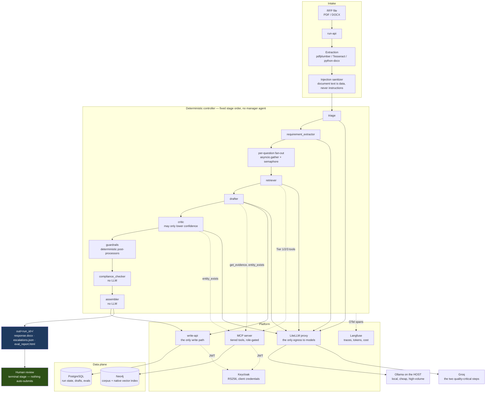

# rfp-workflow

An agentic workflow that ingests one cloud-migration RFP (PDF or DOCX) and
produces a filled draft response where **every answer carries a citation and a
computed confidence score**, an SME escalation list for what it could not
answer, and an automated evaluation report.

Human review is the terminal stage. Nothing is ever auto-submitted.

> **All data in this repository is synthetic.** Every vendor, customer, product,
> case study, and SME is fictional. No real RFP content exists here and none
> ever will (CLAUDE.md rule 1).

**Current phase: 1 of 6 — skeleton and contracts.** The compose stack, typed
contracts, migrations, identity, and CI gates are in place. There are no agents
and no model calls yet; that is deliberate, and the build order is described in
[Build phases](#build-phases) below.

---

## The idea

Most of an RFP response is not a writing problem. It is a retrieval and
governance problem: find what the firm has credibly said before, check that it
is still true, refuse to say anything that is not backed by a source, and route
the rest to a human who owns that topic.

So the model here does very little. It drafts prose, summarizes, and reranks.
Everything else — parsing, scoring arithmetic, template filling, entity lookups,
compliance checks, database writes — is deterministic code. That split is the
whole design, and it is enforced rather than encouraged: agents cannot write
Cypher or SQL, cannot import a provider SDK, cannot raise their own confidence,
and cannot loop.

## Architecture



## Why a knowledge graph

The graph is not a vector store with extra steps. It does six jobs, and dropping
any one of them would push work back onto a human or onto a model that should
not be doing it:

| Role | What it buys |
|---|---|
| **Corpus of record** | Q&A pairs with supersession chains. Superseded answers are flagged, never deleted, so the history of what changed stays auditable. |
| **Hybrid retrieval** | Vector similarity *and* constraint filters resolve in one query. No second datastore, so no sync-lag class of bug. |
| **Grounding registry** | A closed world of nameable entities, including vendor codes. If the drafter names something not in it, the answer hard-fails. |
| **Escalation routing** | `SME OWNS Capability`, so an escalation carries a person's name rather than landing in a queue nobody owns. |
| **Coverage-gap detection** | `NO_MATCH` plus no capability match means nobody owns this topic yet. Exposed as a query, not a spreadsheet. |
| **Lineage** | Citation → answer → author, outcome, and supersession are all one hop away. |

## Quick start

Requirements: Docker (Compose v2+), GNU Make, and a Groq API key. Ollama runs on
the **host**, not in a container.

```bash
git clone https://github.com/t-gandhi-19/rfp-workflow.git
cd rfp-workflow
cp .env.example .env         # then set GROQ_API_KEY
make up                      # infra profile, healthchecked
make demo                    # end-to-end on the golden RFP  (Phase 5)
```

### Local models

`embed-model` is pinned to `nomic-embed-text` (768-dim) and the embedding
dimension is baked into the Neo4j vector index, so `make reembed` exists from
day one for when that pin changes.

The remaining local aliases — `triage-model`, `extract-assist-model`,
`rerank-model`, `loginterp-model` — are pinned to `llama3.2:3b`:

```bash
ollama pull llama3.2:3b
ollama pull nomic-embed-text
OLLAMA_HOST=0.0.0.0 ollama serve    # so containers can reach it
```

CLAUDE.md assumes a Metal GPU on the host. This project was built on Windows on
a Hyper-V VM with **no GPU at all**, so local inference is CPU-only and the
model tier was sized down accordingly. The mechanism is unchanged — Ollama on
the host, reached at `http://host.docker.internal:11434` — only the hardware
premise differs. On a GPU host you can raise the local tier in
`docker/litellm/config.yaml` without touching any code, since model names are
config, never literals.

CI never touches Ollama. It runs against a mocked gateway with recorded
responses, so the quality gates are deterministic and free.

### Make targets

| Target | Does |
|---|---|
| `make up` / `make down` | Bring the compose stack up / down |
| `make migrate` | Apply Alembic migrations |
| `make test` | Unit + security suites |
| `make lint` / `make fmt` | ruff check / ruff format |
| `make logs` | Tail all services |
| `make nuke` | Reset every named volume |
| `make ingest` | Fixtures → graph (Phase 2) |
| `make run FILE=...` | Run one RFP (Phase 4) |
| `make resume RUN=...` | Resume an interrupted run (Phase 4) |
| `make evals` | Eval harness + HTML report (Phase 3) |
| `make reembed` | Re-embed the corpus after a model change (Phase 2) |
| `make explain RUN=...` | Plain-English run narrative (Phase 6) |
| `make demo` | End-to-end on the golden RFP (Phase 5) |

Targets belonging to a later phase exit with a message saying so, rather than
failing obscurely.

## Layout

```
config/       domain, scoring, limits, versioned prompts, rubrics
src/
  contracts/  Pydantic v2 models — the typed boundary everything crosses
  extraction/ deterministic parsing              (Phase 2)
  graph/      Neo4j schema + parameterized queries (Phase 2)
  retrieval/  scoring, graph multiplier, confidence (Phase 3)
  agents/     crewAI agents and tasks            (Phase 4)
  guardrails/ deterministic post-processors      (Phase 4)
  write_api/  the only write path to Postgres
  mcp_server/ role-gated tools over the graph    (Phase 3)
  gateway/    the only module allowed a provider SDK
  evals/      harness — built before the agents  (Phase 3)
fixtures/     synthetic registry, Q&A corpus, golden RFP, answer key
tests/        unit · security · integration
```

## What is guaranteed, and how

These are properties of the build, not intentions. Each one is a test that runs
in CI:

- **Nothing auto-submits.** The `submitter` role exists in the realm and is
  granted to zero service accounts. Asserted statically against the checked-in
  realm export and live against a running Keycloak.
- **No answer ships uncited.** `DraftedAnswer` will not validate with
  `needs_sme_review=False` unless it has at least one source id and no
  unsupported claims.
- **Confidence is computed, never self-reported.** It is arithmetic over the
  primary source's score, claim coverage, and the critic's delta.
- **The critic cannot inflate.** `confidence_delta` is bounded at `<= 0` by the
  contract, so a prompt change cannot quietly turn the critic into a booster.
- **Agents cannot reach a database directly.** Graph access is only through
  tested parameterized functions exposed over MCP; Postgres writes only through
  write-api.
- **No provider SDK outside `src/gateway/`.** Enforced by an AST walk over the
  whole source tree.
- **No f-string SQL.** Also an AST walk — formatting cannot defeat it the way it
  can defeat a grep.
- **No secrets in the repo.** gitleaks blocks the merge.

## Build phases

The eval harness is built **before** the agents. That ordering is deliberate:
quality gates written after the thing they measure tend to encode whatever the
thing already does.

| Phase | Tag | Contents |
|---|---|---|
| 1 | `v0.1` | Skeleton, contracts, migrations, identity, CI gates |
| 2 | `v0.2` | Graph schema and queries, synthetic corpus, golden RFP, extraction |
| 3 | `v0.3` | Scoring, confidence, tiered MCP tools, full eval harness |
| 4 | `v0.4` | Agents, controller, guardrails, assembler, observability |
| 5 | `v0.5` | Adversarial suite, cost and latency reporting, `make demo` |
| 6 | `v0.6` | Streamlit trust dashboard, log interpreter, audit wiring |

## Decision register

Decisions that shape what this system does and does not do. Earlier decisions
(domain, providers, orchestration, gateway, vector store) are recorded in the
build prompt and in the phase PRs; this register carries the ones taken during
the build that a reader would otherwise have to infer from code.

### D16 — LLM-judge-only quality evaluation

**Decision.** Quality evals are scored by `judge-model` alone. The fixed
human spot-check sample and the judge-vs-human agreement metric are removed from
the eval spec and are **not** implemented.

**Compensating controls, all mandatory:**

1. The judge resolves to a **different model family** than the drafter, so a
   model never grades its own prose (self-preference mitigation).
2. The judge prompt and the rubric are **versioned files**, and the version is
   logged on every judge span — a score is always attributable to the exact text
   that produced it.
3. Every judge score **attaches to the run trace** with the judged text's span
   ids, so any score can be audited after the fact rather than taken on trust.
4. The **deterministic zero-tolerance evals** — grounding coverage, entity
   existence, staleness, rejection, confidentiality, compliance — are unaffected.
   They never depended on human judgment, and they carry the trust load.

**Accepted risk, stated plainly.** Judge scores are uncalibrated against human
opinion. A systematic judge bias would be invisible until a human looks. This is
accepted for v1 scope.

**Scope.** This removes the human from the *evaluation harness only*. It does not
touch the pipeline's human review stage, the SME escalation path, the
no-auto-submission rule, or the never-granted `submitter` role — those remain
CLAUDE.md golden rules and are unaffected. Human review is still the terminal
stage of every run.

### D19 addendum / amendment S — self-consistency is not agreement

**The canary had a blind spot, and it was structural.** D19 replaced a
distribution proxy with a probe-based ratchet: `make calibrate` lands the twenty
golden questions on the freshly derived floor and checks each falls on the
correct side. It was described as "the zero-tolerance eval core embedded into
calibration", and it could not see the most serious defect this phase found.

`scripts/calibrate` embeds the corpus, takes dot products, derives a floor, and
lands its probes — all with the same arithmetic. Retrieval judges scores that
come out of the Neo4j vector index, which returns `(1 + cos) / 2` for a cosine
index. **The floor was derived in one unit and applied in another.** The
background *median* cosine of 0.4930 arrived at the floor as 0.7465, calibrated
to 0.9092, and cleared a floor of 0.5975 — so the floor rejected nothing, and
all twenty golden questions MATCHED including the three the corpus cannot
answer. Recall@5 was 0.2667 while every guard reported green.

The probe gate saw none of it because it never reads the index. It was entirely
self-consistent, and consistently wrong against production.

**The general rule, which is the decision:**

> When two subsystems must agree on a unit or a scale, an agreement test exists
> **between** them. A check that shares its inputs with the thing it checks can
> only prove self-consistency, and self-consistency is not agreement.

**Implemented as four things, so the class is closed rather than the instance:**

1. `src/retrieval/units.py` — samples a fixed set of committed pairs, computes
   similarity by direct dot product **and** through the live index, and refuses
   if they differ by more than ε. Runs inside `make calibrate` (fatal, before
   the artifact is written) and inside `make preflight` (cheap: 3 probes, 5
   neighbours, no model call). Failure prints both observed values and names
   both paths.
2. ε = 1e-2, derived in the module. float32's roundoff bounds the disagreement
   at ~9.2e-5; **measurement exceeds that** — up to 2.5e-3 across the 15 pairs
   sampled — consistent with the index scoring on a reduced-precision
   representation. So ε is set from what the check must *discriminate*: the two
   competing unit hypotheses are separated by ≥ 0.1 for any non-duplicate pair,
   making 1e-2 about 4× the worst observation and ≥ 10× tighter than the fault.
   A future sample approaching ε is a finding for this register, not a number to
   raise.
3. The conversion exists at **exactly one site**, asserted by a repo-wide AST
   scan (`tests/security/test_units_conversion_single_site.py`). Applied twice
   it inverts the scale; applied to an already-converted cosine it reproduces
   the original defect.
4. An integration test lands D19 probe 2.7 through **both** paths and requires
   the margins to agree within 0.05 — twice the largest of the corroboration
   deltas measured when the fix landed (0.0026, 0.0030, 0.0060, 0.0141, 0.0246).
   The margin, not the cosine, is what tier 2 gates on.

**What this does not claim.** The probe gate is still worth having; it catches
corpus and model drift, which an agreement test cannot. The two are
complementary, and the lesson is about what a guard's *inputs* let it see.

### D17 addendum — the protected sliver is measured and accepted

D17 split **relevance** (does this candidate qualify?) from **preference** (which
of the qualifying ones wins), so that preference could reorder comparable
candidates without overturning relevance outright. Reworking the scoring tests
onto the commissioned band measured how much protection that actually leaves,
and the answer was not the one the config claimed.

**Measured, on corpus `a3d1eea3a24d6cb7` against `nomic-embed-text:v1.5`:**

| Quantity | Value | Derivation |
|---|---|---|
| Achievable preference range | `[0.765, 1.265]` | worst `0.85 × 1.0 × 0.90`, best `1.15 × 1.1 × 1.00` |
| Configured clamps | `[0.75, 1.30]` | **never bind** — the product cannot reach either |
| Stated inversion boundary | 1.7333 | `clamp_max / clamp_min`, so it inherits the clamps' inertness |
| **Real inversion boundary** | **1.6536** | `1.265 / 0.765` |
| Widest ratio between two above-floor candidates | 1.6735 | `1.0 / 0.5975` |
| **Protected sliver** | **0.0200** | `1.6735 − 1.6536` |

**Decision: accepted as design, not a defect.** A candidate above the floor is by
definition a match; preference deciding among matches is precisely D17's intent,
not a failure of it. The invariant's real work is at the **floor boundary** — the
line between answering and escalating — and the commissioned probe margins show
it holding there with room to spare: the three unanswerables sit 0.3055, 0.2805
and 0.1731 *below* the floor, the weakest answerable 0.2405 *above* it.

The sliver is what remains above the floor, where both candidates already
qualify and the stakes are ordering rather than qualification.

**No constant moves without an observed failure.** The clamps stay, now commented
as inert belt-and-braces that would bind only if the component multipliers
changed. `scoring.yaml`'s boundary comment is corrected from 1.733 to the
achievable 1.6536 with its derivation.

**Enforcement.** `TestOrderingInTheCommissionedBand::test_the_preference_inversion_boundary_from_both_sides`
drives the achievable boundary from both sides; testing 1.733 would assert a
boundary the code cannot reach and would pass whether or not the real one held.
`test_the_configured_clamps_never_actually_bind` pins the inertness, so a change
to the multipliers that makes the clamps live fails loudly.

## Testing

```bash
make test                       # unit + security
pytest tests/unit -q            # contracts, validators
pytest tests/security -q        # submitter, SQL, SDK-import guards
pytest -m integration           # requires `make up`
```

CI runs on every push: ruff → mypy → unit and security tests → gitleaks → a
compose smoke job that brings up the stack, applies migrations, and exercises a
real client-credentials token against write-api (expecting 200, 401, and 403 in
the right places).

### What CI proves, and what it does not

CI has no Ollama (see [Local models](#local-models)), so it ingests and
calibrates with a deterministic stand-in embedder. That makes the split between
the two kinds of evidence in this repo load-bearing, so it is stated in one form
everywhere it applies — here and in `src/gateway/fake_embedder.py`:

> **CI proves the calibration and retrieval machinery end to end.
> The real-model run quoted in every PR proves the semantics.**

Neither substitutes for the other. A green CI says the guards compute, gate and
refuse correctly on vectors whose geometry is known by construction — the
separation guards run **enforcing**, with no exemption, against baselines CI
commissions from its own vectors into a scratch config it cannot write back to.
It says nothing whatever about whether retrieval finds the right answer, because
those vectors carry no meaning.

That question is settled only by the zero-tolerance retrieval evals on real
embeddings, whose numbers every PR quotes. **No CI result may be quoted in their
place.**

## Changelog

### v0.1 — Phase 1: skeleton and contracts
- Docker Compose stack (Postgres, Neo4j, Keycloak, Langfuse, LiteLLM) with
  healthchecks on every service and Keycloak audit events enabled from the start.
- All 13 Pydantic v2 contracts with the invariants above enforced as validators.
- Alembic migrations, three least-privileged Postgres roles.
- Keycloak realm: 10 service accounts, 7 roles, `submitter` granted to nobody.
- write-api with RS256 JWT validation (401 vs 403) and idempotent upserts.
- CI: ruff, mypy (strict on `contracts/` and `graph/`), unit and security tests,
  gitleaks, and a live compose smoke test.

## License

MIT
