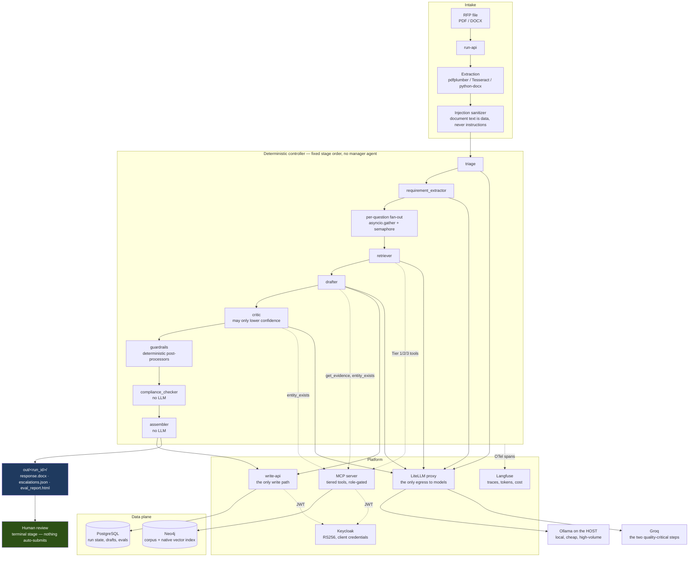

# rfp-workflow

An agentic workflow that ingests one cloud-migration RFP (PDF or DOCX) and
produces a filled draft response where **every answer carries a citation and a
computed confidence score**, an SME escalation list for what it could not
answer, and an automated evaluation report.

Human review is the terminal stage. Nothing is ever auto-submitted.

> **All data in this repository is synthetic.** Every vendor, customer, product,
> case study, and SME is fictional. No real RFP content exists here and none
> ever will (CLAUDE.md rule 1).

**Current phase: 1 of 6 — skeleton and contracts.** The compose stack, typed
contracts, migrations, identity, and CI gates are in place. There are no agents
and no model calls yet; that is deliberate, and the build order is described in
[Build phases](#build-phases) below.

---

## The idea

Most of an RFP response is not a writing problem. It is a retrieval and
governance problem: find what the firm has credibly said before, check that it
is still true, refuse to say anything that is not backed by a source, and route
the rest to a human who owns that topic.

So the model here does very little. It drafts prose, summarizes, and reranks.
Everything else — parsing, scoring arithmetic, template filling, entity lookups,
compliance checks, database writes — is deterministic code. That split is the
whole design, and it is enforced rather than encouraged: agents cannot write
Cypher or SQL, cannot import a provider SDK, cannot raise their own confidence,
and cannot loop.

## Architecture



## Why a knowledge graph

The graph is not a vector store with extra steps. It does six jobs, and dropping
any one of them would push work back onto a human or onto a model that should
not be doing it:

| Role | What it buys |
|---|---|
| **Corpus of record** | Q&A pairs with supersession chains. Superseded answers are flagged, never deleted, so the history of what changed stays auditable. |
| **Hybrid retrieval** | Vector similarity *and* constraint filters resolve in one query. No second datastore, so no sync-lag class of bug. |
| **Grounding registry** | A closed world of nameable entities, including vendor codes. If the drafter names something not in it, the answer hard-fails. |
| **Escalation routing** | `SME OWNS Capability`, so an escalation carries a person's name rather than landing in a queue nobody owns. |
| **Coverage-gap detection** | `NO_MATCH` plus no capability match means nobody owns this topic yet. Exposed as a query, not a spreadsheet. |
| **Lineage** | Citation → answer → author, outcome, and supersession are all one hop away. |

## Quick start

Requirements: Docker (Compose v2+), GNU Make, and a Groq API key. Ollama runs on
the **host**, not in a container.

```bash
git clone https://github.com/t-gandhi-19/rfp-workflow.git
cd rfp-workflow
cp .env.example .env         # then set GROQ_API_KEY
make up                      # infra profile, healthchecked
make demo                    # end-to-end on the golden RFP  (Phase 5)
```

### Local models

`embed-model` is pinned to `nomic-embed-text` (768-dim) and the embedding
dimension is baked into the Neo4j vector index, so `make reembed` exists from
day one for when that pin changes.

The remaining local aliases — `triage-model`, `extract-assist-model`,
`rerank-model`, `loginterp-model` — are pinned to `llama3.2:3b`:

```bash
ollama pull llama3.2:3b
ollama pull nomic-embed-text
OLLAMA_HOST=0.0.0.0 ollama serve    # so containers can reach it
```

CLAUDE.md assumes a Metal GPU on the host. This project was built on Windows on
a Hyper-V VM with **no GPU at all**, so local inference is CPU-only and the
model tier was sized down accordingly. The mechanism is unchanged — Ollama on
the host, reached at `http://host.docker.internal:11434` — only the hardware
premise differs. On a GPU host you can raise the local tier in
`docker/litellm/config.yaml` without touching any code, since model names are
config, never literals.

CI never touches Ollama. It runs against a mocked gateway with recorded
responses, so the quality gates are deterministic and free.

### Make targets

| Target | Does |
|---|---|
| `make up` / `make down` | Bring the compose stack up / down |
| `make migrate` | Apply Alembic migrations |
| `make test` | Unit + security suites |
| `make lint` / `make fmt` | ruff check / ruff format |
| `make logs` | Tail all services |
| `make nuke` | Reset every named volume |
| `make ingest` | Fixtures → graph (Phase 2) |
| `make run FILE=...` | Run one RFP (Phase 4) |
| `make resume RUN=...` | Resume an interrupted run (Phase 4) |
| `make evals` | Eval harness + HTML report (Phase 3) |
| `make reembed` | Re-embed the corpus after a model change (Phase 2) |
| `make explain RUN=...` | Plain-English run narrative (Phase 6) |
| `make demo` | End-to-end on the golden RFP (Phase 5) |

Targets belonging to a later phase exit with a message saying so, rather than
failing obscurely.

## Layout

```
config/       domain, scoring, limits, versioned prompts, rubrics
src/
  contracts/  Pydantic v2 models — the typed boundary everything crosses
  extraction/ deterministic parsing              (Phase 2)
  graph/      Neo4j schema + parameterized queries (Phase 2)
  retrieval/  scoring, graph multiplier, confidence (Phase 3)
  agents/     crewAI agents and tasks            (Phase 4)
  guardrails/ deterministic post-processors      (Phase 4)
  write_api/  the only write path to Postgres
  mcp_server/ role-gated tools over the graph    (Phase 3)
  gateway/    the only module allowed a provider SDK
  evals/      harness — built before the agents  (Phase 3)
fixtures/     synthetic registry, Q&A corpus, golden RFP, answer key
tests/        unit · security · integration
```

## What is guaranteed, and how

These are properties of the build, not intentions. Each one is a test that runs
in CI:

- **Nothing auto-submits.** The `submitter` role exists in the realm and is
  granted to zero service accounts. Asserted statically against the checked-in
  realm export and live against a running Keycloak.
- **No answer ships uncited.** `DraftedAnswer` will not validate with
  `needs_sme_review=False` unless it has at least one source id and no
  unsupported claims.
- **Confidence is computed, never self-reported.** It is arithmetic over the
  primary source's score, claim coverage, and the critic's delta.
- **The critic cannot inflate.** `confidence_delta` is bounded at `<= 0` by the
  contract, so a prompt change cannot quietly turn the critic into a booster.
- **Agents cannot reach a database directly.** Graph access is only through
  tested parameterized functions exposed over MCP; Postgres writes only through
  write-api.
- **No provider SDK outside `src/gateway/`.** Enforced by an AST walk over the
  whole source tree.
- **No f-string SQL.** Also an AST walk — formatting cannot defeat it the way it
  can defeat a grep.
- **No secrets in the repo.** gitleaks blocks the merge.

## Build phases

The eval harness is built **before** the agents. That ordering is deliberate:
quality gates written after the thing they measure tend to encode whatever the
thing already does.

| Phase | Tag | Contents |
|---|---|---|
| 1 | `v0.1` | Skeleton, contracts, migrations, identity, CI gates |
| 2 | `v0.2` | Graph schema and queries, synthetic corpus, golden RFP, extraction |
| 3 | `v0.3` | Scoring, confidence, tiered MCP tools, full eval harness |
| 4 | `v0.4` | Agents, controller, guardrails, assembler, observability |
| 5 | `v0.5` | Adversarial suite, cost and latency reporting, `make demo` |
| 6 | `v0.6` | Streamlit trust dashboard, log interpreter, audit wiring |

## Testing

```bash
make test                       # unit + security
pytest tests/unit -q            # contracts, validators
pytest tests/security -q        # submitter, SQL, SDK-import guards
pytest -m integration           # requires `make up`
```

CI runs on every push: ruff → mypy → unit and security tests → gitleaks → a
compose smoke job that brings up the stack, applies migrations, and exercises a
real client-credentials token against write-api (expecting 200, 401, and 403 in
the right places).

## Changelog

### v0.1 — Phase 1: skeleton and contracts
- Docker Compose stack (Postgres, Neo4j, Keycloak, Langfuse, LiteLLM) with
  healthchecks on every service and Keycloak audit events enabled from the start.
- All 13 Pydantic v2 contracts with the invariants above enforced as validators.
- Alembic migrations, three least-privileged Postgres roles.
- Keycloak realm: 10 service accounts, 7 roles, `submitter` granted to nobody.
- write-api with RS256 JWT validation (401 vs 403) and idempotent upserts.
- CI: ruff, mypy (strict on `contracts/` and `graph/`), unit and security tests,
  gitleaks, and a live compose smoke test.

## License

MIT
